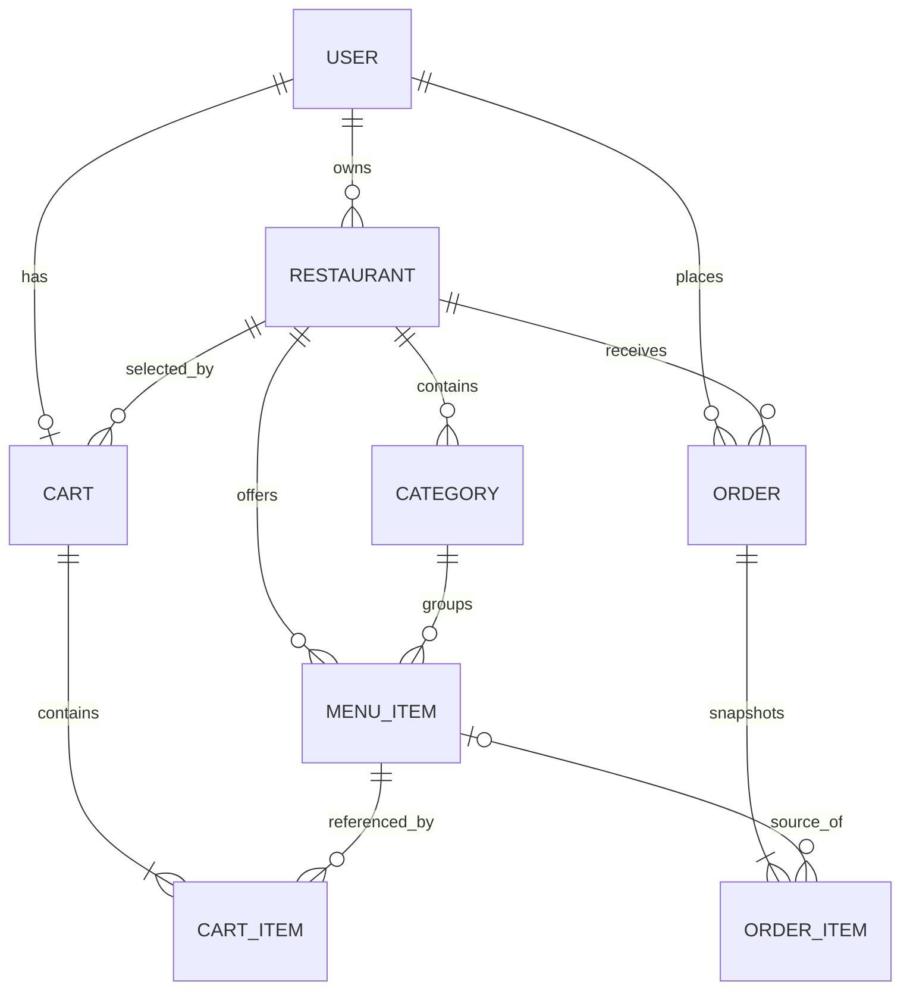

# Proposed Database Model (Review Draft)

This is a logical model for review only. Do not create collections or migrations until open business decisions are resolved and the design is approved.

## ERD

MongoDB stores cart items and order items as embedded subdocuments, so `CART_ITEM` and `ORDER_ITEM` are logical ERD elements, not necessarily collections. The menu item reference in an order is nullable to preserve history if an item is later removed.

## Collections and fields

Conventions: MongoDB `_id` ObjectId primary key; UTC `createdAt`/`updatedAt`; money stored as integer minor units (for example, paisa) to avoid floating-point errors, subject to confirmation of currency. `createdBy`/`updatedBy` are ObjectId references on administratively managed records where useful. Mongoose timestamps are enabled. Soft deletion uses `deletedAt` (nullable); deactivation uses `isActive`/`isAvailable` and is distinct from deletion.

### users

| Field | Type | Nullable | Notes |
| --- | --- | --- | --- |
| `_id` | ObjectId | No | Primary key |
| `name` | string | No | Trimmed, bounded length |
| `email` | string | No | Normalized lowercase |
| `passwordHash` | string | No | Never serialized |
| `phone` | string | Yes | E.164-like validation pending |
| `role` | enum | No | `customer`, `restaurant_admin`, `super_admin` |
| `status` | enum | No | Proposed `active`, `blocked`; default active |
| `tokenVersion` | integer | No | Optional coarse revocation mechanism |
| `createdAt`, `updatedAt` | date | No | UTC |
| `deletedAt` | date | Yes | Optional soft deletion; see retention question |

Indexes: unique `{ email: 1 }`; `{ role: 1, status: 1 }` for admin filters. Email uniqueness with soft deletion requires a policy decision (global unique recommended).

### restaurants

`name` (required string), `description` (nullable string), `ownerUserId` (required User ref), `phone`/`email` (nullable strings), `address` (proposed structured object: address lines, city, postal code, country), `city` (required for current filter), `image` (nullable provider asset metadata), `openingTime`/`closingTime` (nullable local-time strings pending schedule model), `timeZone` (required if hours drive open status), `isOpen` (computed/live status versus manually controlled is unresolved), `isActive` (boolean, default true), timestamps, `createdBy`/`updatedBy`, `deletedAt` (nullable).

Indexes: `{ isActive: 1, city: 1, name: 1 }`; text/search index or Atlas Search decision pending; `{ ownerUserId: 1, isActive: 1 }`.

### categories

`restaurantId` (required Restaurant ref), `name` (required), `normalizedName` (required), `description` (nullable), `image` (nullable), `sortOrder` (integer default 0), `isActive` (boolean default true), timestamps, audit user refs, `deletedAt` (nullable).

Indexes: unique active category `{ restaurantId: 1, normalizedName: 1 }` (partial-filter approach and restore behavior to be specified); `{ restaurantId: 1, isActive: 1, sortOrder: 1 }`.

### menu_items

`restaurantId` (required Restaurant ref), `categoryId` (required Category ref), `name` (required), `description` (nullable), `priceMinor` (required integer > 0), `discountPriceMinor` (nullable; if supplied must be positive and below price), `image` (nullable), `ingredients` (array of strings, default empty), `isAvailable` (boolean default true), `preparationTimeMinutes` (nullable positive integer), timestamps, audit refs, `deletedAt` (nullable).

Indexes: `{ restaurantId: 1, categoryId: 1, isAvailable: 1 }`, `{ restaurantId: 1, priceMinor: 1 }`, active name/search index according to search decision. Enforce category and item restaurant match in the application service; MongoDB cannot express this cross-document foreign key.

### carts

One active cart per customer. `userId` (required unique User ref), `restaurantId` (nullable Restaurant ref while empty), `items` (bounded embedded array of `{ menuItemId, quantity }`; do not persist trusted prices), `updatedAt` and optionally timestamps. Totals are calculated for display from current item prices and are never authoritative persisted inputs. Decide whether adding an item from another restaurant rejects or replaces the cart.

Indexes: unique `{ userId: 1 }`; `{ restaurantId: 1 }` only if operationally useful. Cart item count/maximum quantity limits require product decision.

### orders

`orderNumber` (required unique human-readable ID), `userId`, `restaurantId` (required refs), `items` embedded immutable snapshots `{ menuItemId: nullable ObjectId, name, unitPriceMinor, quantity, lineSubtotalMinor }`, `deliveryAddress` snapshot (structured, required for delivery), `phone` snapshot, `subtotalMinor`, `deliveryFeeMinor`, `discountMinor`, `totalMinor`, `currency`, `paymentMethod` enum (at least `cash`; online options unresolved), `paymentStatus` enum (`pending`, `paid`, `failed`, `refunded`), `orderStatus` enum (`pending`, `confirmed`, `preparing`, `ready`, `out_for_delivery`, `delivered`, `cancelled`, `rejected`), `notes` nullable, timestamps, `cancelledAt` nullable, and `statusHistory` embedded bounded entries `{ from, to, actorUserId, at, reason? }`.

Indexes: unique `{ orderNumber: 1 }`; `{ userId: 1, createdAt: -1 }`; `{ restaurantId: 1, orderStatus: 1, createdAt: -1 }`; optional `{ restaurantId: 1, orderNumber: 1 }` search. Index date/status fields used by admin statistics.

### Future collections (excluded from initial schema)

Coupons/redemptions, reviews, favorites, saved addresses, notifications, and payment attempts are optional requirements. If coupons are selected, an order must snapshot applied coupon and discount calculation, and redemptions need concurrency-safe usage tracking.

## Relationships and deletion policy

- User owns zero or more restaurants per ERD; supplied model implies an owner per restaurant but does not limit admins to one restaurant. Confirm whether one admin can own/manage multiple.
- Category and menu item each belong to one restaurant; a menu item's category must belong to the same restaurant.
- Order belongs to one customer and one restaurant. Order snapshots survive menu/user/restaurant deactivation.
- Cart is one per user and holds one restaurant. A cart does not guarantee reserved stock or price.
- Use deactivation for restaurants/categories/items. Prefer archival/soft deletion where history matters. Do not cascade-delete orders. Exact delete permissions and behavior need confirmation.

## Transaction boundaries

1. **Register:** create user; unique index handles concurrent duplicate emails.
2. **Cart mutation:** validate menu item and restaurant state, update one cart document atomically.
3. **Checkout:** read cart and current menu/restaurant data, calculate totals, create order, clear cart in a MongoDB transaction. Use idempotency key to prevent duplicate orders on retries (decision pending). A transaction requires replica set deployment.
4. **Order status update/cancel:** conditional update verifies current state and actor scope, and appends status history in same document write.
5. **Coupon redemption, if included:** transaction or atomic conditional counter/update to enforce limits.

## Migrations and integrity

Use versioned migration scripts for index/schema/data changes; Mongoose schema declarations alone do not replace production migration planning. Add indexes through controlled migrations. Use application-level references and existence checks; MongoDB does not enforce relational foreign keys. Validate IDs and handle stale references explicitly.
